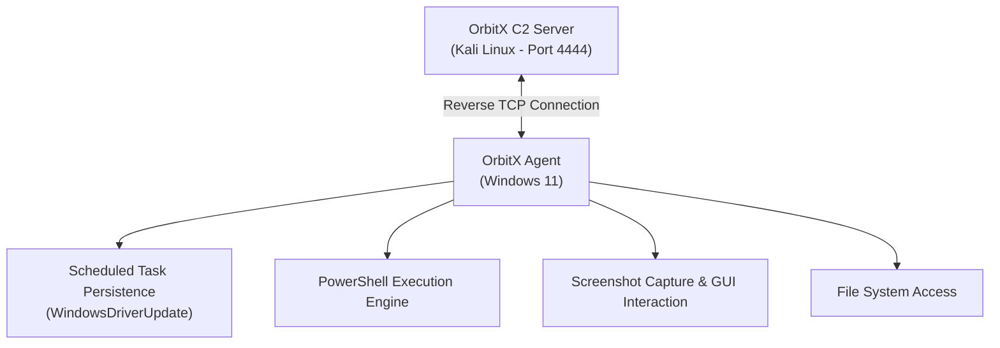

# Architecture of Project OrbitX

## Overview

**Project OrbitX** is a lightweight educational Command & Control (C2) framework designed to demonstrate real-world RAT (Remote Access Trojan) techniques in an isolated lab environment.

It consists of two primary components:

- **C2 Server** (`c2_server.py`) — Attacker side (Kali Linux)
- **Agent** (`agent.ps1` → `agent.exe`) — Victim side (Windows)

---

# High-Level Architecture Diagram



---

# Component Details

## 1. C2 Server (`c2_server.py`)

### Language
- Python 3

### Function
- Multi-threaded TCP server listening on port `4444`

### Key Features

- Custom protocol with response delimiter:
  ```text
  ===END_OF_RESPONSE===
  ```

- Automatic session handling
- Clean `OrbitX>` interactive prompt
- Fancy ASCII banner on startup

---

## 2. Windows Agent (`agent.ps1` / `agent.exe`)

### Language
- PowerShell (compiled to EXE)

### Core Mechanism

- Infinite reconnection loop:

```powershell
while ($true) {
    # Reconnect logic
}
```

### Reconnection Delay
- 8 seconds

---

# Persistence Mechanism

## MITRE ATT&CK
- `T1053.005` — Scheduled Task / Job: Scheduled Task

The agent uses Windows Scheduled Tasks for persistence.

```powershell
Register-ScheduledTask `
    -TaskName "WindowsDriverUpdate" `
    -User "SYSTEM" `
    -Action (New-ScheduledTaskAction -Execute "C:\ProgramData\Updater\agent.exe") `
    -Trigger (New-ScheduledTaskTrigger -AtStartup)
```

## Why It Works

- Runs automatically at system startup
- Executes with `NT AUTHORITY\SYSTEM` privileges
- Survives reboots and user logoffs

---

# Network Communication

## Connection Type
- Reverse Shell

## Communication Flow
- Agent connects outbound to the C2 server

## Protocol
- TCP

## Port
- `4444`

## Advantage

- Helps bypass many firewall restrictions on inbound connections

---

# Privilege Escalation Flow

## Initial Execution
- Runs under the current logged-in user

Example:
```text
midhammer\ghost
```

## After Persistence + Reboot
- Runs as:

```text
NT AUTHORITY\SYSTEM
```

## Why This Happens

The Scheduled Task is explicitly configured to run under the `SYSTEM` account, causing the agent to execute with elevated privileges after reboot.

---

# Summary

Project OrbitX demonstrates:

- Reverse TCP C2 communication
- Persistence using Scheduled Tasks
- PowerShell-based agent execution
- Basic privilege escalation concepts
- Multi-threaded C2 infrastructure
- Realistic RAT behavior in a controlled lab environment